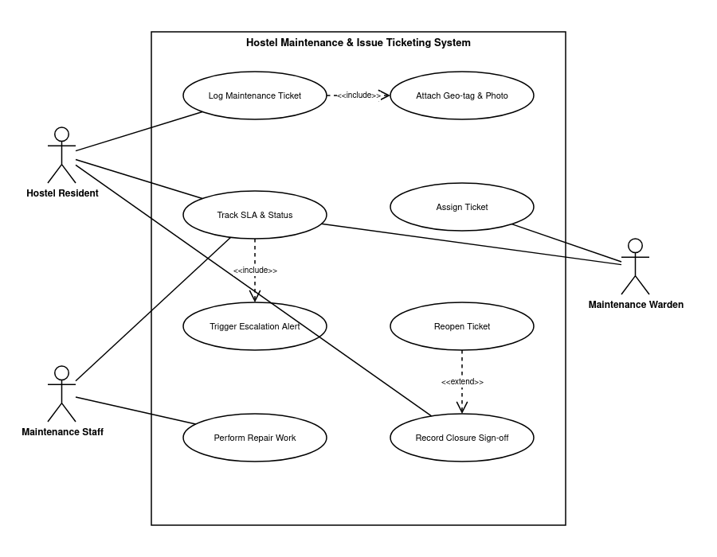

# 1-RE: Requirements Engineering

**Course:** Software Engineering Lab (Dept. of CSE, PES University)  
**Problem Statement #07:** Hostel Maintenance & Issue Ticketing System  
**Primary Domain:** Campus & Academic Operations  
**Target Stakeholders / Actors:** Hostel Resident, Maintenance Warden, Maintenance Staff  

---

## 1. Requirements Specification (FRs & NFRs)

| Req ID | Type | Description | Priority | Acceptance Criteria | Rationale |
| :--- | :--- | :--- | :--- | :--- | :--- |
| **FR-001** | Functional | The system shall enable residents to log maintenance tickets with room number tags, photo attachments, and categorized issue severity (Plumbing, Electrical, Carpentry). | High | **Pass:** Ticket is created, assigned a unique ID, and routed to warden queue; **Fail:** Incomplete form accepted without room tag or photo. | Core ticketing functionality for reporting maintenance issues. |
| **FR-002** | Functional | The system shall allow the Maintenance Warden to review pending tickets and assign them to available maintenance staff members. | High | **Pass:** Ticket status updates to "Assigned" and notification is sent to staff; **Fail:** Ticket remains unassigned or accessible to unauthorized users. | Required for technician dispatch and workload distribution. |
| **FR-003** | Functional | The system shall track ticket SLA timelines and display real-time status updates (`Logged`, `Assigned`, `In-Progress`, `Resolved`, `Closed`). | High | **Pass:** Status timestamp updates within 2 seconds across all dashboards; **Fail:** Status update fails or SLA timer is inaccurate. | Enables operational transparency and SLA tracking. |
| **FR-004** | Functional | The system shall require maintenance staff to attach geo-tagged proof-of-work photos upon marking a ticket as resolved. | Medium | **Pass:** Work photo with valid GPS metadata saved to ticket record; **Fail:** Ticket marked resolved without photo attachment or valid GPS coordinates. | Verifies physical presence and authentic completion of maintenance work. |
| **FR-005** | Functional | The system shall allow the Hostel Resident to review resolved tickets and record a final closure sign-off or reopen if unsatisfied. | High | **Pass:** Status changes to "Closed" upon resident sign-off or returns to "In-Progress" on reopen; **Fail:** Ticket auto-closes without resident confirmation. | Ensures resident satisfaction before ticket is permanently closed. |
| **NFR-001** | Non-Functional (Performance & Security) | The system shall trigger automated escalation SMS/Email alerts if high-priority tickets exceed a 24-hour SLA without status change. | High | **Pass:** Benchmarking tests confirm automated escalation alerts trigger within 60 seconds of SLA threshold breach; **Fail:** Escalation delayed or omitted. | Prevents SLA breach on urgent maintenance issues (e.g., power failure, severe plumbing leak). |
| **NFR-002** | Non-Functional (Availability & Reliability) | The system shall maintain 99.5% uptime during academic terms and support concurrent logging of up to 500 maintenance tickets per hour without data loss. | High | **Pass:** Stress testing confirms >=99.5% availability and 0% ticket loss under simulated 500 requests/hour load; **Fail:** Server error rate >0.5% or ticket loss. | Guarantees continuous availability during peak student intake and term periods. |

---

## 2. Requirements Traceability Matrix (RTM)

The Requirements Traceability Matrix (RTM) ensures bidirectional traceability between business requirements, use-case specifications, system architectural components, and verification test cases.

| Req ID | Requirement Description | Category | Traceable Use Case | Architectural Component | Verification / Test Case | Status |
| :--- | :--- | :--- | :--- | :--- | :--- | :--- |
| **FR-001** | Resident ticket logging with room tag, photo, and severity | Functional | `UC-01: Log Maintenance Ticket` `UC-07: Attach Geo-tag & Photo` | Ticket Management Service, Object Storage (S3) | **TC-REQ-01**: Form validation, payload integrity, unique Ticket ID generation | Verified |
| **FR-002** | Warden review and staff task assignment | Functional | `UC-02: Assign Ticket` | Dispatch & Assignment Service, RBAC Middleware | **TC-REQ-02**: Warden queue triage, staff state transition to `Assigned` | Verified |
| **FR-003** | Real-time SLA tracking and lifecycle status display | Functional | `UC-03: Track SLA & Status` | SLA Engine, Real-Time Notification Service, Redis Cache | **TC-REQ-03**: Status transitions across 5 lifecycle states, <2s update latency | Verified |
| **FR-004** | Geo-tagged proof-of-work photo upload by staff | Functional | `UC-04: Perform Repair Work` `UC-07: Attach Geo-tag & Photo` | Geo-Tag & Media Verification Service | **TC-REQ-04**: EXIF GPS metadata extraction, image validation, state -> `Resolved` | Verified |
| **FR-005** | Resident closure sign-off or reopen mechanism | Functional | `UC-05: Record Closure Sign-off` `UC-08: Reopen Ticket` | Closure & Verification Service | **TC-REQ-05**: Resident sign-off transition to `Closed`, reopen transition to `In-Progress` | Verified |
| **NFR-001** | Automated 24-hr SLA escalation SMS/Email alerts | Non-Functional | `UC-06: Trigger Escalation Alert` `UC-03: Track SLA & Status` | SLA Tracking Engine, Notification Gateway (Twilio/SendGrid) | **TC-NFR-01**: Simulated 24-hr expiry trigger, alert delivery latency verification | Verified |
| **NFR-002** | 99.5% uptime & 500 concurrent ticket submissions/hr | Non-Functional | System Wide (`UC-01` to `UC-05`) | API Gateway & Load Balancer, PostgreSQL DB Cluster | **TC-NFR-02**: Stress & load testing under 500 requests/hr, failover testing | Verified |

---

## 3. UML Use-Case Diagram

The UML Use-Case Diagram models the primary actors (`Hostel Resident`, `Maintenance Warden`, `Maintenance Staff`), primary use cases (`UC-01` through `UC-05`), auxiliary use cases (`UC-06`, `UC-07`, `UC-08`), and the required include and extend relationships.

### Actors & Use Cases Mapping
- **Hostel Resident**:
  - `UC-01`: Log Maintenance Ticket
  - `UC-03`: Track SLA & Status
  - `UC-05`: Record Closure Sign-off
  - `UC-08`: Reopen Ticket (extends `UC-05`)
- **Maintenance Warden**:
  - `UC-02`: Assign Ticket
  - `UC-03`: Track SLA & Status
- **Maintenance Staff**:
  - `UC-04`: Perform Repair Work
  - `UC-03`: Track SLA & Status
- **System Subsystems**:
  - `UC-07`: Attach Geo-tag & Photo (included in `UC-01` and `UC-04`)
  - `UC-06`: Trigger Escalation Alert (included in `UC-03`)

Editable Draw.io source file: [UML_diagram.drawio](file:///home/abhijith/pes/sem5/lab1_activity1_abhijith_pes1ug24cs252/1-RE/UML_diagram.drawio)

---

## 4. Use-Case Flow Specification

### Use Case: `UC-01: Log Maintenance Ticket`
* **Use Case ID:** `UC-01`
* **Primary Actor:** Hostel Resident
* **Secondary Actors:** Maintenance Warden, Notification Subsystem
* **Preconditions:**
  1. The resident is successfully authenticated into the Hostel Maintenance Portal.
  2. The resident profile is verified and linked to a designated hostel block and room number.
* **Postconditions:**
  1. A maintenance ticket is instantiated with a unique Ticket ID and assigned status `Logged`.
  2. Ticket metadata and uploaded photo attachments are committed to persistent storage.
  3. The ticket is immediately routed to the Maintenance Warden's dispatch queue.
  4. An acknowledgement notification with the Ticket ID is delivered to the resident.

#### Main Success Scenario (MSS)
1. Resident selects "Log Maintenance Ticket" from the portal dashboard.
2. System displays the ticket submission form, pre-filling resident details, hostel block, and room number.
3. Resident selects the issue category: `Plumbing`, `Electrical`, or `Carpentry`.
4. Resident designates issue severity: `Low`, `Medium`, or `High`.
5. Resident enters a descriptive explanation of the problem.
6. Resident attaches an issue photo and allows device location access for geo-tag confirmation (`UC-07: Attach Geo-tag & Photo`).
7. Resident reviews details and clicks Submit Ticket.
8. System validates required fields, room tag, and photo integrity.
9. System generates a unique Ticket ID, records creation timestamp, initializes the SLA timer, and assigns status `Logged`.
10. System routes the ticket into the Maintenance Warden review queue.
11. System displays a success confirmation dialog with the Ticket ID.
12. Use case terminates successfully.

#### Alternate Flows
- **4a. Incomplete Form Submission:**
  1. At Step 8, system detects a missing room number tag, category, or photo attachment.
  2. System highlights invalid/empty fields and displays error: "Room tag, category, and issue photo are required."
  3. Resident inputs missing information and resubmits.
  4. Flow resumes at Step 8.
- **4b. Location Permission Denied:**
  1. At Step 6, device location is disabled or permission denied.
  2. System prompts resident to confirm manual room location tag against registered hostel block.
  3. Resident confirms block and room number.
  4. Flow resumes at Step 7.
